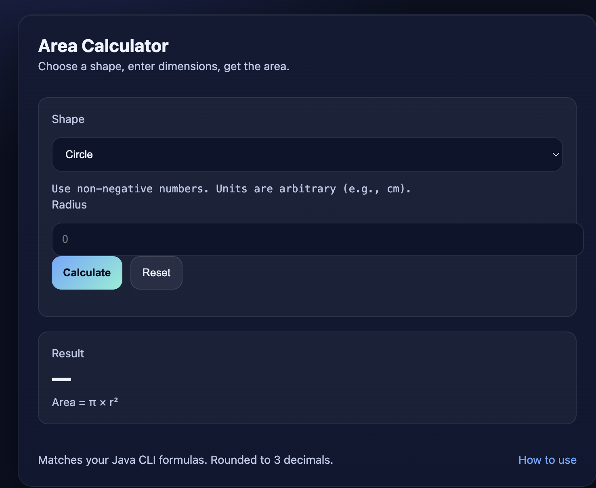

# Area Calculator

A simple **Area Calculator** implemented in **Java** (CLI) and as an **interactive web app**.  
The project demonstrates basic control flow, user input handling, and UI design for multiple shapes.

---

## 📌 Features
- **Java CLI Version**:
  - Menu-based shape selection
  - Calculates areas for:
    - Circle
    - Triangle
    - Rectangle
    - Square
    - Trapezoid
  - Uses `Scanner` for user input
  - Rounds output to 3 decimal places
- **Web Version**:
  - Runs entirely in the browser
  - Auto-updates inputs for selected shape
  - Error handling for missing/invalid values
  - Mobile-friendly responsive design

---

## 📸 Screenshots

**Web UI**  

**Java CLI**  
